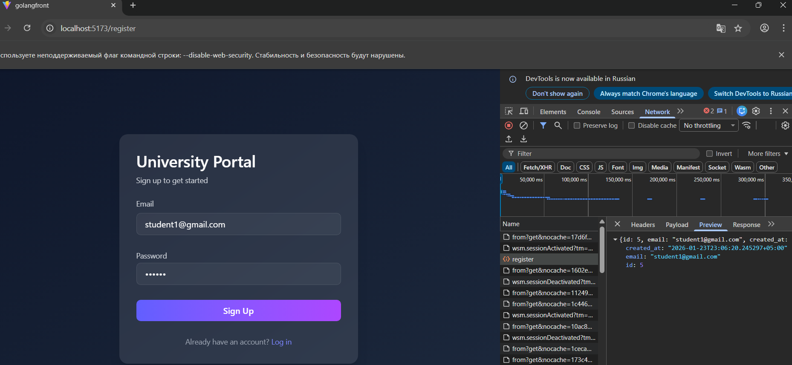
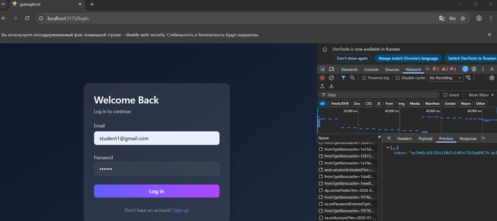

# React + TypeScript + Vite

# Frontend Authentication Pages

This project contains a simple frontend implementation of **Login** and **Register** pages built with **Vite + React**, styled using **Tailwind CSS**, and connected to a backend authentication API.

The goal of this frontend is to demonstrate basic authentication flow, routing between pages, and successful communication with the backend.

---

## Technologies Used

* Vite
* React
* React Router (Data Router API)
* Tailwind CSS
* Fetch API

---

## Features

* Login page with email and password fields
* Registration page with email and password fields
* Client-side routing between `/login` and `/register`
* Redirect from `/` to `/login`
* POST requests sent to backend authentication endpoints
* Clean and minimal UI

---

## Routing Structure

The application uses React Router with `createBrowserRouter`.

| Path        | Description           |
| ----------- | --------------------- |
| `/`         | Redirects to `/login` |
| `/login`    | Login page            |
| `/register` | Registration page     |

---

## Backend Integration

The frontend communicates with the backend using HTTP POST requests.

### Register Endpoint

```
POST /auth/register
```

Request body:

```json
{
  "email": "user@example.com",
  "password": "password",
  "role_id": 1,
}
```

### Login Endpoint

```
POST /auth/login
```

Request body:

```json
{
  "email": "user@example.com",
  "password": "password"
}
```

The backend responses were tested successfully and screenshots of the responses are included below.

---

## Screenshots

### Register Response



### Login Response



---

## Notes

* Authentication logic is handled by the backend.
* The frontend currently does not store tokens or protect routes.
* This setup is intended for educational purposes and further extension.

